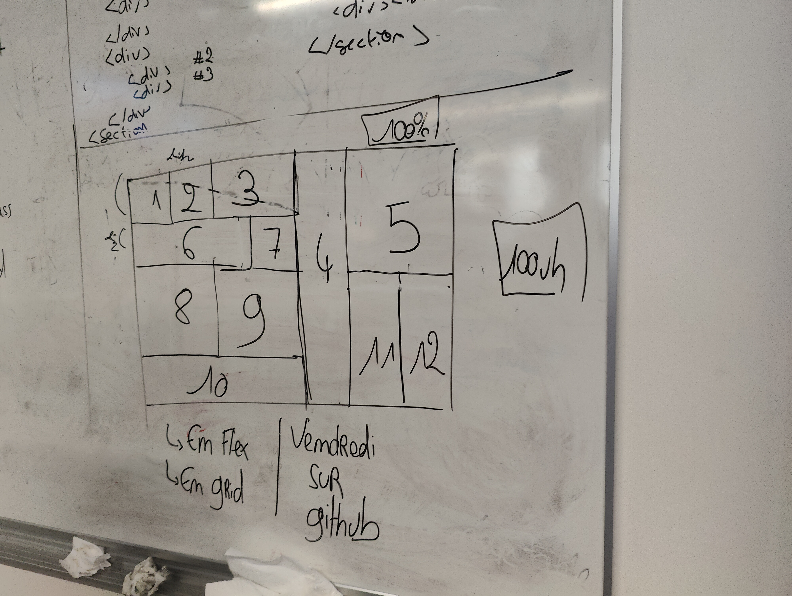

<h1> Exercice de Grid </h1>

Reposit d'un exercice sur les "grid" qui avait pour consigne de reproduire le paterne ci-dessous, en Html et CSS.
L'exercice à été fait deux fois: Une fois en utilisant des flexs box et une fois avec display Grid.

